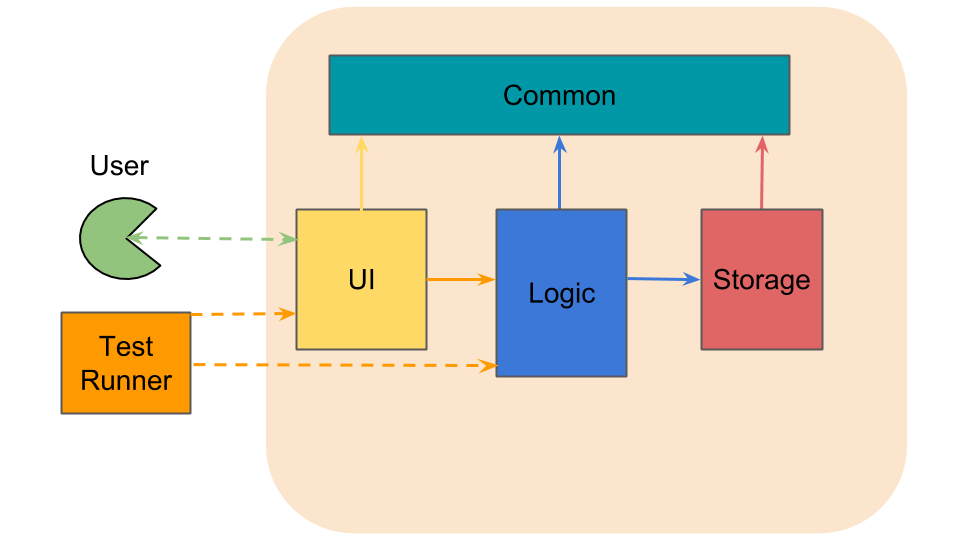

#Developer Guide

##Introduction
Raijin is a simple desktop todo manager to helps to manage and keep track of todos on a daily basis 

##Vision
We aim to be the most widely used todo manager in National University of Singapore. 

##Table of Contents

- [Architecture](#architecture)
- [Ui Component](#ui-component)
  - [`Ui Class Diagram`](#ui-class-diagram)
  - [`MainApplication` Class](#mainapplication-class)
  - [`DisplayController` Class](#displaycontroller-class)
  - [`InputController` Class](#inputcontroller-class)
  - [`FeedbackController` Class](#feedbackcontroller-class)
  - [`Resources`](#resources)
- [Logic Component](#logic-component)
  - [`Logic Class Diagram`](#logic-class-diagram)
  - [`Logic` Class](#logic-class)
  - [`Parser` Class](#parser-class)
  - [`CommandRunner` Class](#commandrunner-class)
  - [`CommandDispatcher` Class](#commanddispatcher-class)
  - [`CommandRunnerFactory` Class](#commandrunnerfactory-class)
  - [`Notable APIs for Logic` Class](#notable-apis-for-logic-class)
- [Storage Component](#storage-component)
  - [`Storage Class Diagram`](#storage-class-diagram)
  - [`TasksManager` Class](#tasksmanager-class)
  - [`History` Class](#history-class)
  - [`StorageHandler` Class](#storagehandler-class)
  - [`Notable APIs for Storage` Class](#notable-apis-for-storage-class)
- [Common Component](#common-componenet)
  - [`Common Class Diagram`](#common-class-diagram)
  - [`Task` Class](#task-class)
  - [`DateTime` Class](#datetime-class)
  - [`Status` Class](#status-class)
  - [`RaijinException` Class](#raijinexception-class)
  - [`RaijinLogger` Class](#raijinlogger-class)
  - [`Notable APIs for Common` Class](#notable-apis-for-common-class)

##Architecture

The architecture of Raijin consists of 5 main components: UI, Logic, Storage, Data,
and Common. After receiving user input, `UI` will send user input to `Logic` which will executes the command
and write any changes to `Storage`. `Data` is used by `Logic` and `UI` to access user's configuration file as 
well as user data. `Common` contains useful data types and utilites used by the other components.

>Figure1: Component diagram of Raijin

##Ui Component
The UI component is consists of a JavaFX `MainApplication` class which utilises 3 different controllers:
`DisplayController`, `FeedbackController` and `InputController` to handle logics of individual panes in 
a `Scene`. Besides that, `Resources` stores basic `fxml` files which configures each pane and `css` files
to handle visual elements of each panes.

>Figure2: UI Class Diagram 

###`MainApplication` class
The main JavaFx application class that handles any interaction with users and displaying feedback to the 
user with the use of various controllers.

###`DisplayController` class
This class is responsible to display result of search, display or serves as welcome screen that shows
primarily all results of user commands. It will load corresponding `fxml` and `css` file to maniputate 
the elements the contrainer .

###`InputController` class
In contrast to`DisplayController`, this class handles all user input in the form of keypress. Besides that, 
it will also handle any keyboard-shortcuts used to launch specific function of the program. By segregating the `Scene`
into various panes allowed for higher modularity and loose coupling.

###`Feedback Controller` class
Unlike the two previous controllers, this class has a very specific role of only relaying feedback status 
that is concise and short to the user. This could inform the user with status of the program and any exception
that can occur while processing the command.

###`Resources`
Though this is not a class, it is essential to the UI component because it stores the individual `fxml` and 
`css` files used by the controller.

##Logic Component
The Logic component carries out main processing of the program and connects various componenets together 
to execute a command. 

>Figure3: Logic Class Diagram 

###`Logic` class
This is the brain of Raijin as it handles majority of the logic of the program. For instance, it is responsible 
in delegating user input to the `Parser` and also retrieving specific user's configuration via the `Data` component.
The class also acts as a glue that connects different components of the program.

###`Parser` class
Another important class is the `Parser` which analyzes user's input and convert them into 
a `Command` object according to grammar rules of the program. 

###`CommandRunner` class
This serves as an interface for different commands that is expected from the user. Reasoning behind this is to allow 
for loose coupling and invert dependency on low level implementation. Class that implement this interface will
communicate with `Storage` class to write and retrieve relevant informations about the command. 

###`Notable APIs for Logic` class

##Storage Component
This component acts like a warehouse where any class that desire to access program's internal memory or to write any changes is dependent on this component. For now, the componenet stores `Memory` of the program and also `History` stack that allows user to undo/redo any action. Besides that, the `StorageHandler` helps to convert internal representation of tasks to JSON String before being stored to `UserData`. 

>Figure4: Storage Class Diagram 

###`TasksManager` class
This class stores the internal state of the program which consists of objects such as 
Task and Status.`Logic` class will communicate via this api to access information about the tasks.

###`History` class 
This class helps to store the snapshots of the program's internal state. It allows user to redo and 
undo certain actions. 

###`StorageHandler` class
Consists various utility function that helps to read and write `Memory` to JSON file. Besides that, 
the class also performs basic data integrity check on the JSON file as well as retrieving user's
config file.

###`Notable APIs for Storage` class

##Common Component
This component consists of universally used data types across the program such as `Task`, `DateTime` and 
`Feedback`. It also contains useful utility functions that is reusable by other component such as `Logger`. 

>Figure6: Common Class Diagram 

###`Task` class
When a user creates a task, this class will stores all the relevant data such as name, deadline, tag , 
or priority. 

###`DateTime` class
Due to various formats of `DateTime` that may be inserted by the user. This class helps to standardise the 
format used by the program regardless of user input. 

###`Feedback` class
It is utilized to provide users with immediate feedback about the result of a command as well as whether a 
command is executed successfully. 

###`Logger` class
Provides individual class with a logger 

###`Notable APIs for Common` class

