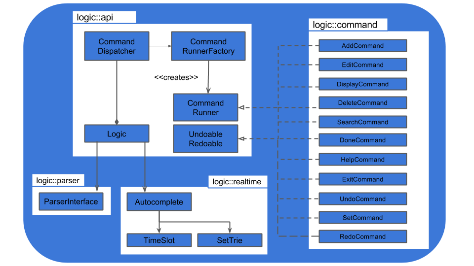
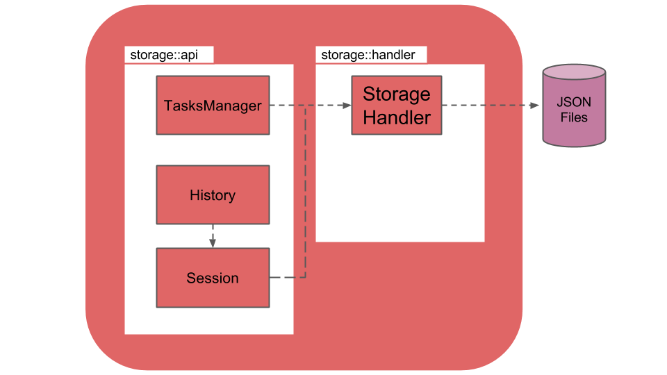

#Developer Guide

##Introduction
Raijin is a simple desktop todo manager to helps to manage and keep track of todos on a daily basis 

##Vision
We aim to be the most widely used todo manager in National University of Singapore. 

##Table of Contents

- [Architecture](#architecture)
- [Ui Component](#ui-component)
  - [`Ui Class Diagram`](#ui-class-diagram)
  - [`MainApplication` Class](#mainapplication-class)
  - [`InputController` Class](#inputcontroller-class)
  - [`DisplayController` Class](#displaycontroller-class)
  - [`Resources`](#resources)
- [Logic Component](#logic-component)
  - [`Logic Class Diagram`](#logic-class-diagram)
  - [`Logic` Class](#logic-class)
  - [`Parser` Claass](#parser-class)
  - [`CommandRunner` Class](#commandrunner-class)
- [Storage Component](#storage-component)
  - [`Storage Class Diagram`](#storage-class-diagram)
  - [`Memory` Class](#memory-class)
  - [`History` Class](#history-class)
  - [`StorageHandler` Class](#storagehandler-class)
- [Data Component](#data-component)
  - [`Data Class Diagram`](#data-class-diagram)
  - [`DataHandler` Class](#datahandler-class)
  - [`UserConfig` Class](#userconfig-class)
  - [`UserData` Class](#userdata-class)
- [Common Component](#common-componenet)
  - [`Common Class Diagram`](#common-class-diagram)
  - [`Task` Class](#task-class)
  - [`DateTime` Class](#datetime-class)
  - [`Feedback` Class](#feedback-class)
  - [`Logger` Class](#logger-class)

##Architecture

>Figure1: Component diagram of Raijin

##Ui Component

>Figure2: UI Class Diagram 

##Logic Component

>Figure3: Logic Class Diagram 

##Storage Component

>Figure4: Storage Class Diagram 

##Data Component

>Figure5: Data Class Diagram 

##Common Component

>Figure6: Common Class Diagram 
